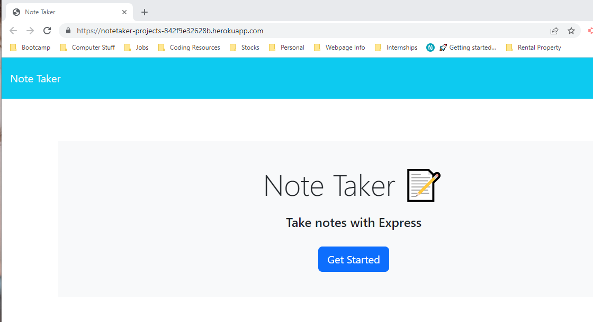
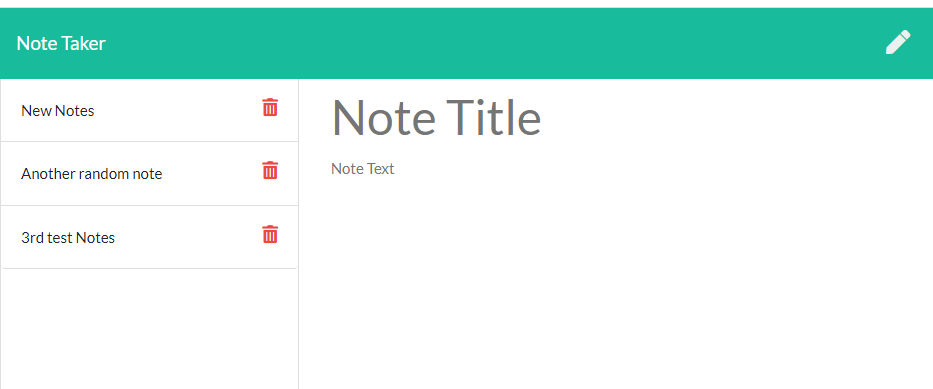

# Note Taker Project

## Description
This project  is to create an application called Note Taker that can be used to write and save notes. This application uses an Express.js back end and will save and retrieve note data from a JSON file.

## Table of Contents

- [Usage](#usage)
- [Technologies](#Technologies)
- [Credits](#credits)
- [License](#license)
- [Contact](#Contact)

## Usage
To create a new note, utilize the provided text fields to enter a title for your note and input the desired content. Once you have filled out the note, click on the Save icon. This action will save your note to the Note Taker server.

To view a previously written note, simply click on the desired note from the list in the left-hand column. The note's title and text will then be displayed in the right-hand column, allowing you to review its content.

https://notetaker-projects-842f9e32628b.herokuapp.com/

USER STORY: AS A small business owner
I WANT to be able to write and save notes
SO THAT I can organize my thoughts and keep track of tasks I need to complete.

ACCEPTANCE CRITERIA: GIVEN a note-taking application
WHEN I open the Note Taker
THEN I am presented with a landing page with a link to a notes page.
WHEN I click on the link to the notes page
THEN I am presented with a page with existing notes listed in the left-hand column, plus empty fields to enter a new note title and the note’s text in the right-hand column.
WHEN I enter a new note title and the note’s text
THEN a Save icon appears in the navigation at the top of the page.
WHEN I click on the Save icon
THEN the new note I have entered is saved and appears in the left-hand column with the other existing notes.
WHEN I click on an existing note in the list in the left-hand column
THEN that note appears in the right-hand column.
WHEN I click on the Write icon in the navigation at the top of the page
THEN I am presented with empty fields to enter a new note title and the note’s text in the right-hand column.
## Links
https://notetaker-projects-842f9e32628b.herokuapp.com/
## Technologies

- JavaScript
- Node.js
- NPM
- Express

## Credits
Credit to my tutor. She has been helpful in helping me understand many of the complex topics. My instructor for teaching it to us and Google/Stackoverflow when I got errors I was able to troubleshoot.
## License
MIT License

## Contact
mariayaslinskiy@gmail.com
YaslinskiyM Github